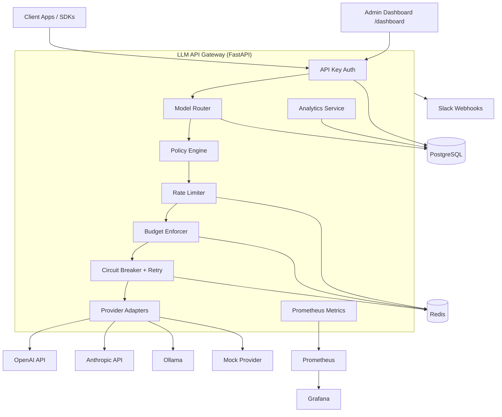
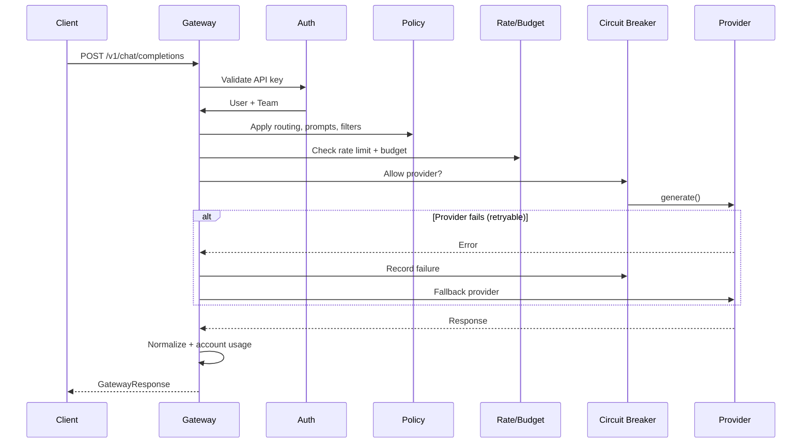
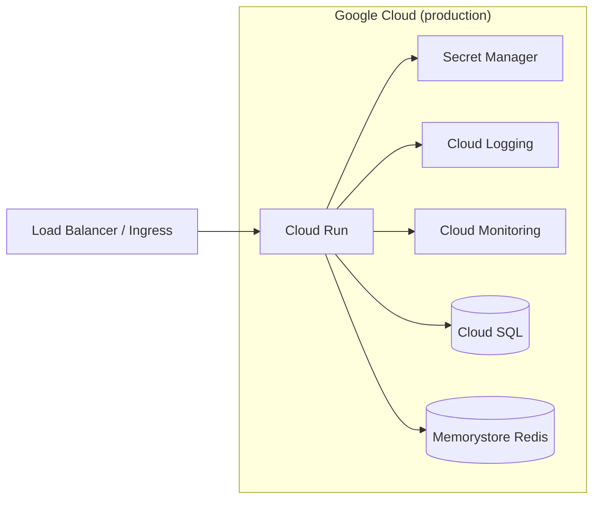

# Architecture

End-to-end architecture of the LLM API Gateway across all six phases.

## System context

## Request sequence (non-streaming)

## Deployment topology

## Component map

| Layer | Components |
|-------|------------|
| API | FastAPI routers, SSE streaming, admin APIs |
| Auth | API keys, roles (admin/developer/viewer), team scoping |
| Routing | DB model registry + YAML heuristics + fallback chains |
| Policy | System prompts, content filters, routing preferences |
| Quota | Redis token buckets, atomic budget counters |
| Resilience | Circuit breakers, retries, health probes, failover |
| Observability | Prometheus, OTel, Grafana, admin dashboard, Slack |
| Data | PostgreSQL (tenancy, usage, audit), Redis (distributed state) |

## Phase evolution

| Phase | Focus |
|-------|-------|
| 1 | Gateway core, providers, normalization |
| 2 | Auth, teams, policies, admin APIs |
| 3 | Rate limits, budgets, audit logs |
| 4 | Circuit breakers, retries, failover |
| 5 | Metrics, analytics, dashboards, alerts |
| 6 | Integration tests, load testing, documentation |

See individual phase docs: [phase1.md](phase1.md) through [phase6.md](phase6.md).
